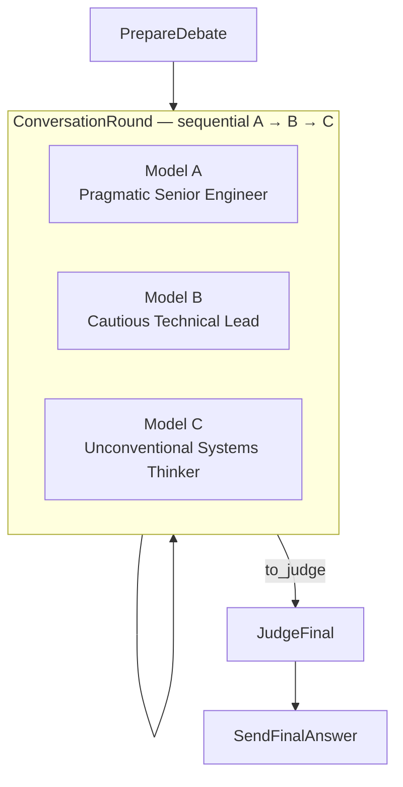

# PocketFlow Multi-Model Debate


## Features

- **Web-based Interface**: Built with Gradio for an accessible and user-friendly experience
- **Multi-Model Debate**: Three distinct AI personas engage in a sequential conversation (A → B → C), building on each other's positions
- **Real-Time Streaming**: Live SSE stream showing each model's reasoning as it happens
- **Editorial UI**: Newspaper-inspired design with live deliberation floor visualization
- **Synthesis**: A judge model uses extractive-then-synthesise mode to produce a calibrated final answer

## Quick Start

1. **Install required dependencies**:
    ```bash
    pip install -r requirements.txt
    ```

2. **Set environment variables** — create a `.env` file or export directly:
    ```bash
    export OPENROUTER_API_KEY="your-openrouter-api-key"
    export OPENROUTER_MODEL="mistralai/mistral-small-2603"   # or any OpenRouter model
    export APP_NAME="PocketFlow-Debate-Chat"                  # optional, for analytics
    ```

3. **Run the Application**:
    ```bash
    python main.py
    ```
    This starts the Gradio web interface at `http://localhost:7860` and the SSE stream server at `http://localhost:7861/stream`.

## How It Works

The system implements a PocketFlow async workflow with a sequential conversational debate pipeline:



The workflow consists of the following nodes:

1. **PrepareDebate**: Formats the user's chat history and current question into a debate context
2. **ConversationRound**: Runs a sequential conversation round where each model hears the previous speakers:
   - **Round 1 — Opening Statements**: Each model presents their initial position based on the user's question
     - **Model A** — Pragmatic Senior Engineer: direct recommendation, top reasons, one wrong-when, 24-hour action
     - **Model B** — Cautious Technical Lead: responds to A with hidden assumptions, overlooked risks, missing info, recommendation + caveat
     - **Model C** — Unconventional Systems Thinker: responds to both A and B with a reframe, non-obvious alternative, assumption critique, recommendation
   - **Round 2 — Reply Round**: All three models respond to each other's opening statements in a conversational back-and-forth (under 200 words each)
3. **JudgeFinal**: Synthesizes the full debate transcript into one calibrated final answer — resolving conflicts, combining the strongest points, removing weak claims
4. **SendFinalAnswer**: Delivers the verdict to the user and signals end-of-flow to all queues

### Prompt files

All system and user prompts live in `prompts/` as plain-text files and are loaded at startup by `nodes.py`:

| File | Used by |
|---|---|
| `model_a_system.txt` / `model_a_user.txt` | Model A (Pragmatic Senior Engineer) |
| `model_b_system.txt` / `model_b_user.txt` | Model B (Cautious Technical Lead) |
| `model_c_system.txt` / `model_c_user.txt` | Model C (Unconventional Systems Thinker) |
| `model_a_reply_system.txt` | Model A reply round |
| `model_b_reply_system.txt` | Model B reply round |
| `model_c_reply_system.txt` | Model C reply round |
| `judge_final_system.txt` | JudgeFinal synthesiser |

### Real-Time Streaming

The application provides live visualization of the debate:
- Phase transitions (`model_a → model_b → model_c → round2 → judge`) are signalled via null-byte sentinels (`\x00PHASE:name\x00`) in the stream queue
- Each model's tokens stream in real time to its own lane on "The Floor"
- The UI shows active, done, and idle states for each deliberation stage

## Files

| Path | Purpose |
|---|---|
| [`main.py`](./main.py) | Entry point, Gradio interface, SSE streaming server |
| [`flow.py`](./flow.py) | PocketFlow graph and node connections |
| [`nodes.py`](./nodes.py) | Async node definitions for the debate pipeline |
| [`frontend/`](./frontend/) | CSS, JavaScript, and HTML partials for the UI |
| [`prompts/`](./prompts/) | System and user prompt text files |
| [`utils/call_llm.py`](./utils/call_llm.py) | Sync/async LLM calls with retry and observability |
| [`utils/conversation.py`](./utils/conversation.py) | In-memory conversation cache with TTL |
| [`utils/observability.py`](./utils/observability.py) | structlog + OpenTelemetry setup |
| [`tests/`](./tests/) | Pytest async unit tests for nodes and flow |
| [`compare_prompts.py`](./compare_prompts.py) | Script to benchmark old vs new prompts side-by-side |

## Requirements

- Python 3.10+
- PocketFlow >= 0.0.3
- Gradio >= 6.0.0
- OpenAI SDK >= 2.0.0 (pointed at OpenRouter)
- structlog, opentelemetry-sdk (observability)
- python-dotenv (env var loading)
