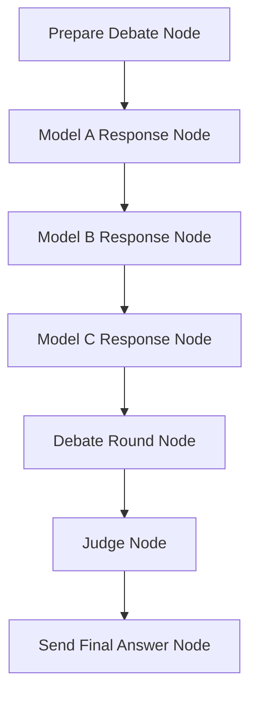

# Design Doc: Multi-Model Debate Chat

> Please DON'T remove notes for AI

## Requirements

> Notes for AI: Keep it simple and clear.
> If the requirements are abstract, write concrete user stories

- **US-1**: As a user, I want to ask any question in a chat interface and receive one clear final answer.
- **US-2**: As a user, I want multiple AI models to debate possible answers before the system responds, so the final answer is more robust.
- **US-3**: As a user, I want the system to use only LLM calls and no external APIs or tools, so all reasoning happens through model-to-model conversation.
- **US-4**: As a user, I want a judge model to review the debate and produce the final answer, so the response is concise, balanced, and directly addresses my query.
- **US-5**: As a user, I want to see the high-level debate progress in the flow visualization, without exposing unnecessary private reasoning.
- **US-6**: As a user, I want to see live token streaming in a side panel as the debate progresses.

## Flow Design

> Notes for AI:
> 1. Consider the design patterns of agent, map-reduce, rag, and workflow. Apply them if they fit.
> 2. Present a concise, high-level description of the workflow.

### Applicable Design Pattern:

**Sequential Multi-Agent Debate Workflow**: The system runs three LLM-backed model nodes one after another, each producing a candidate answer with a distinct persona. A debate round node then critiques all three responses in one LLM call. A final judge node synthesizes the debate into a single user-facing answer.

**Reduce Step**: The judge node acts as a reducer. It compresses the debate outputs into one final response, selecting the strongest points, resolving disagreements, and removing unsupported claims.

### Flow high-level Design:

1. **Prepare Debate Node**: Reads the user query and chat history, then initializes the debate state.
2. **Model A Response Node**: Produces a direct and practical candidate answer.
3. **Model B Response Node**: Produces a cautious and analytical candidate answer (sequential, after Model A).
4. **Model C Response Node**: Produces a creative and alternative-thinking candidate answer (sequential, after Model B).
5. **Debate Round Node**: Reviews all three model responses in a single LLM call, producing structured critique.
6. **Judge Node**: Reads model responses and debate critique, then writes the final synthesized answer.
7. **Send Final Answer Node**: Sends the judge's final answer to the Gradio UI and ends the flow turn.



## Utility Functions

> Notes for AI:
> 1. Understand the utility function definition thoroughly by reviewing the doc.
> 2. Include only the necessary utility functions, based on nodes in the flow.

1. **Call LLM** (`utils/call_llm.py`)
   - Uses the OpenAI SDK pointed at OpenRouter (`https://openrouter.ai/api/v1`).
   - Reads `OPENROUTER_API_KEY`, `OPENROUTER_MODEL`, and `APP_NAME` from environment variables.
   - `call_llm(message, system_prompt)` → `str`: synchronous, returns the full response.
   - `call_llm_stream(message, system_prompt, stream_queue)` → `str`: streams tokens into `stream_queue` in real time, returns the full accumulated response.
   - Used by all debate model nodes, the debate round node, and the judge node.

2. **Conversation Management** (`utils/conversation.py`)
   - In-memory cache (`conversation_cache` dict) keyed by `conversation_id`.
   - `load_conversation(conversation_id)` → dict: returns the session dict or `{}` if not found.
   - `save_conversation(conversation_id, session)`: writes session back to the cache.
   - Used to persist debate state across nodes within the same request.

3. **Format Chat History** (`utils/format_chat_history.py`)
   - *Input*: history (list of dicts with `role` and `content`)
   - *Output*: formatted string (`"role: content"` lines joined by newline, or `"No history"`)
   - Filters out assistant messages that start with flow-visualization emoji prefixes (`🤔`, `➡️`, `⬅️`).
   - Used by `PrepareDebate` to build the debate context passed to all downstream nodes.

## Node Design

### Shared Store

> Notes for AI: Try to minimize data redundancy

```python
shared = {
    "conversation_id": str,   # Unique UUID for the conversation session
    "history": list,          # Prior messages: [{"role": "user"/"assistant", "content": str}]
    "query": str,             # The current user input
    "queue": Queue,           # Queue for the final answer (read by Gradio)
    "flow_queue": Queue,      # Queue for flow-progress log messages (None = flow done)
    "stream_queue": Queue,    # Queue for live token streaming to the SSE server / Gradio panel
}
```

**State Management Note**: Debate-specific state is stored in the conversation session keyed by `conversation_id`, not duplicated in `shared`. The session accumulates keys as the flow progresses.

Session state after a full flow run:

```python
session = {
    "debate_context": str,         # Formatted chat history + current query + date
    "model_responses": {
        "model_a": str,            # Direct & Practical response
        "model_b": str,            # Cautious & Analytical response
        "model_c": str,            # Creative & Alternative response
    },
    "debate_transcript": [
        {"speaker": "model_a", "content": str},
        {"speaker": "model_b", "content": str},
        {"speaker": "model_c", "content": str},
        {"speaker": "debate_round", "content": str},
    ],
    "debate_critique": str,        # Full critique output from the Debate Round node
    "judge_answer": str,           # Final synthesized answer from the Judge node
    "action_result": str,          # Copy of judge_answer saved after SendFinalAnswer
}
```

### Node Steps

> Notes for AI: Carefully decide whether to use Batch/Async Node/Flow.

1. **Prepare Debate Node** (`PrepareDebate`)
   - *Purpose*: Initialize the debate for the current user query.
   - *Type*: Regular
   - *Steps*:
     - *prep*: Read `conversation_id`, `history`, and `query` from `shared`. Load existing session.
     - *exec*: Build `debate_context` string: formatted chat history + current user query + current date.
     - *post*: Save `debate_context`, empty `model_responses` dict, empty `debate_transcript` list, and `judge_answer = None` to the session. Put `"🎯 Preparing debate context..."` into `flow_queue`. Return `"default"`.

2. **Model A Response Node** (`ModelAResponse`)
   - *Purpose*: Produce the first candidate answer — direct, practical, and actionable.
   - *Persona*: "You are Model A, a direct and practical AI assistant."
   - *Type*: Regular
   - *Steps*:
     - *prep*: Load `debate_context` from session. Read `stream_queue` from `shared` (may be `None`).
     - *exec*: Call `call_llm_stream` (if `stream_queue` present) or `call_llm` with a prompt asking for a direct, actionable answer.
     - *post*: Save response under `model_responses["model_a"]` and append `{"speaker": "model_a", "content": ...}` to `debate_transcript`. Put `"✅ Model A (Direct & Practical) has responded"` into `flow_queue`. Return `"default"`.

3. **Model B Response Node** (`ModelBResponse`)
   - *Purpose*: Produce a second candidate answer — cautious, risk-aware, edge-case focused.
   - *Persona*: "You are Model B, a cautious and analytical AI assistant."
   - *Type*: Regular
   - *Steps*:
     - *prep*: Load `debate_context` from session. Read `stream_queue`.
     - *exec*: Call LLM asking to identify assumptions, edge cases, risks, and missing information.
     - *post*: Save under `model_responses["model_b"]`, append to `debate_transcript`. Put `"✅ Model B (Cautious & Analytical) has responded"` into `flow_queue`. Return `"default"`.

4. **Model C Response Node** (`ModelCResponse`)
   - *Purpose*: Produce a third candidate answer — creative, alternative-framing, non-obvious.
   - *Persona*: "You are Model C, a creative and alternative-thinking AI assistant."
   - *Type*: Regular
   - *Steps*:
     - *prep*: Load `debate_context` from session. Read `stream_queue`.
     - *exec*: Call LLM asking for non-obvious approaches, problem reframing, and creative solutions.
     - *post*: Save under `model_responses["model_c"]`, append to `debate_transcript`. Put `"✅ Model C (Creative & Alternative) has responded"` into `flow_queue`. Return `"default"`.

5. **Debate Round Node** (`DebateRound`)
   - *Purpose*: Produce a structured critique of all three model responses in a single LLM call.
   - *Type*: Regular
   - *Steps*:
     - *prep*: Load `debate_context` and `model_responses` from session. Read `stream_queue`.
     - *exec*: Call LLM with all three model responses, asking for strengths, weaknesses, and improvement suggestions for each. Uses a facilitator system prompt.
     - *post*: Append `{"speaker": "debate_round", "content": ...}` to `debate_transcript`. Save critique separately as `debate_critique` in session. Put `"🔄 Debate round completed - models critiqued each other"` into `flow_queue`. Return `"default"`.

6. **Judge Node** (`Judge`)
   - *Purpose*: Synthesize model responses and debate critique into one final user-facing answer.
   - *Type*: Regular
   - *Steps*:
     - *prep*: Load `debate_context`, `model_responses`, and `debate_critique` from session. Read `stream_queue`.
     - *exec*: Call LLM with all responses and critique, instructing it to resolve conflicts, combine strongest points, remove weak claims, and return only the final answer (no meta-commentary).
     - *post*: Save result as `judge_answer` in session. Put `"⚖️ Judge has synthesized the final answer"` into `flow_queue`. Return `"default"`.

7. **Send Final Answer Node** (`SendFinalAnswer`)
   - *Purpose*: Deliver the judge's answer to the UI and signal end-of-flow.
   - *Type*: Regular
   - *Steps*:
     - *prep*: Put `None` into `flow_queue` (signals flow done to Gradio). If `stream_queue` is present, put `None` into it (signals end of stream). Load `judge_answer` from session and read `queue` from `shared`.
     - *exec*: Put `judge_answer` then `None` into `queue` (the Gradio chat queue).
     - *post*: Save `judge_answer` as `action_result` in session. Return `"done"`.

## UI & Streaming (`main.py`)

The UI is built with **Gradio** (`gr.Blocks`, theme `"ocean"`) and served at the default port. A separate **SSE server** runs on port `7861` to push live token streaming to the browser.

### SSE Server (`SSEHandler`)
- Listens on `GET /stream`.
- Reads tokens from the global `_active_stream_queue`.
- Sends each token as `data: {"token": "..."}` SSE events; sends `event: done` on `None`.
- Started as a daemon thread at module load time.

### Gradio Layout
- **Left column (scale=2)**: `gr.Chatbot` + text input + Send button + Clear button.
- **Right column (scale=1)**: "Live Stream" panel — a static HTML `<div>` with `id="stream-output"` and `id="stream-status"`. JavaScript injected via `head=SSE_JS` connects to the SSE server and updates the div in real time.

### Flow Callbacks
- `add_user_message(message, history)`: appends the user turn and clears the input box (runs without queue).
- `run_debate(history, uuid_state)`: generator function.
  1. Extracts `query` and `conversation_id` (from `uuid_state`).
  2. Creates `chat_queue`, `flow_queue`, and `stream_queue`.
  3. Sets `_active_stream_queue = stream_queue` (picked up by the SSE server).
  4. Builds `shared` dict and submits `chat_flow.run(shared)` to a `ThreadPoolExecutor` (max 5 workers).
  5. Yields placeholder `"... *Debating* ..."` immediately, then polls both `stream_queue` and `flow_queue` at 50 ms intervals, updating the chatbot with accumulated streamed tokens.
  6. Once `flow_queue` signals done (`None`), drains any remaining stream tokens, then reads the final answer from `chat_queue` and appends it as `"### Final Answer\n\n{final}"`.
- Clear button resets the chatbot and generates a new `uuid.uuid4()` conversation ID.
