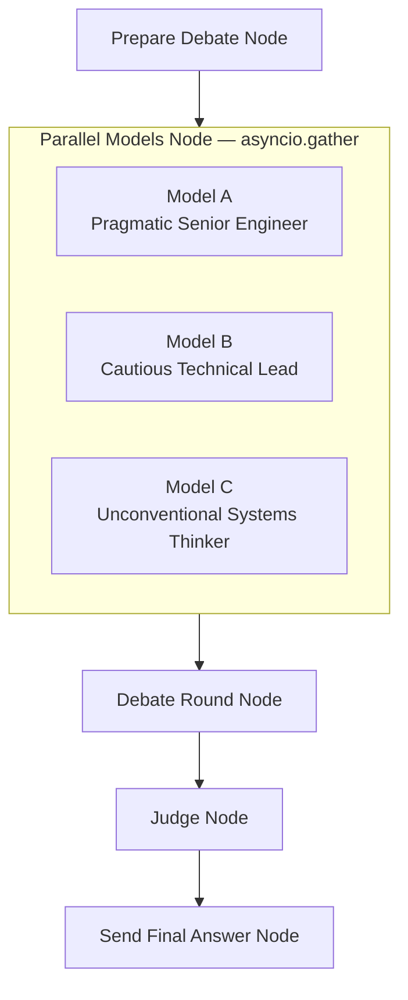

# Design Doc: Multi-Model Debate Chat

> Please DON'T remove notes for AI

## Requirements

> Notes for AI: Keep it simple and clear.
> If the requirements are abstract, write concrete user stories

- **US-1**: As a user, I want to ask any question in a chat interface and receive one clear final answer.
- **US-2**: As a user, I want multiple AI models to debate possible answers before the system responds, so the final answer is more robust.
- **US-3**: As a user, I want the system to use only LLM calls and no external APIs or tools, so all reasoning happens through model-to-model conversation.
- **US-4**: As a user, I want a judge model to review the debate and produce the final answer, so the response is concise, balanced, and directly addresses my query.
- **US-5**: As a user, I want to see the high-level debate progress in the flow visualization, without exposing unnecessary private reasoning.
- **US-6**: As a user, I want to see live token streaming in a side panel as the debate progresses.

## Flow Design

> Notes for AI:
> 1. Consider the design patterns of agent, map-reduce, rag, and workflow. Apply them if they fit.
> 2. Present a concise, high-level description of the workflow.

### Applicable Design Pattern:

**Parallel Multi-Agent Debate with Reduce**: The system runs three LLM-backed model nodes **concurrently** via `asyncio.gather`, each producing a candidate answer with a distinct persona. A debate round node then evaluates all three responses on four structured dimensions. A final judge node extracts the strongest claims, resolves contradictions using the debate critique, and synthesises one calibrated user-facing answer.

**Map step**: `ParallelModels` maps the same debate context to three independent model calls concurrently.

**Reduce step**: The `Judge` node reduces the three responses + debate critique into one final answer using extractive-then-synthesise mode.

### Flow high-level Design:

1. **Prepare Debate Node**: Reads the user query and chat history, then initialises the debate state.
2. **Parallel Models Node**: Runs Model A, B, and C concurrently via `asyncio.gather`. Each streams tokens in real time to its own UI lane.
3. **Debate Round Node**: Evaluates all three model responses in a single LLM call using four structured dimensions (Accuracy, Completeness, Actionability, Intellectual Honesty). Closes with "Key Takeaways for Judge".
4. **Judge Node**: Reads model responses and debate critique, extracts the strongest claim from each model, resolves contradictions, and writes one calibrated final answer.
5. **Send Final Answer Node**: Sends the judge's final answer to the Gradio UI and ends the flow turn.



## Utility Functions

> Notes for AI:
> 1. Understand the utility function definition thoroughly by reviewing the doc.
> 2. Include only the necessary utility functions, based on nodes in the flow.

1. **Call LLM** (`utils/call_llm.py`)
   - Uses the OpenAI SDK pointed at OpenRouter (`https://openrouter.ai/api/v1`).
   - Reads `OPENROUTER_API_KEY`, `OPENROUTER_MODEL`, and `APP_NAME` from environment variables.
   - `call_llm_stream(message, system_prompt, token_queue)` → `str`: streams tokens into `token_queue` in real time via `\x00PHASE:name\x00` sentinels, returns the full accumulated response.
   - Retries on `APIConnectionError`, `APIStatusError` (429/500/502/503), `APITimeoutError`, and base `APIError` (e.g. mid-stream disconnects) with exponential backoff.
   - Emits an OpenTelemetry span per call with `llm.prompt_chars`, `llm.response_chars`, `llm.latency_ms`.
   - Used by all debate model nodes, the debate round node, and the judge node.

2. **Async Call LLM** (`utils/call_llm_async.py`)
   - Async wrapper around the same OpenRouter endpoint.
   - `call_llm_async(message, system_prompt)` → `str`: non-streaming, awaitable. Used by test scripts.

3. **Conversation Management** (`utils/conversation.py`)
   - In-memory cache (`conversation_cache` dict) keyed by `conversation_id` with 30-minute TTL.
   - `load_conversation(conversation_id)` → dict: returns the session dict or `{}` if not found.
   - `save_conversation(conversation_id, session)`: writes session back to the cache.
   - Used to persist debate state across nodes within the same request.

4. **Format Chat History** (`utils/format_chat_history.py`)
   - *Input*: history (list of dicts with `role` and `content`)
   - *Output*: formatted string (`"role: content"` lines joined by newline, or `"No history"`)
   - Filters out assistant messages that start with flow-visualisation emoji prefixes (`🤔`, `➡️`, `⬅️`).
   - Used by `PrepareDebate` to build the debate context passed to all downstream nodes.

5. **Observability** (`utils/observability.py`)
   - Configures `structlog` to write structured JSON logs to `debate.log`.
   - Sets up an OpenTelemetry `TracerProvider` with `ConsoleSpanExporter` (replace with OTLP for production).
   - Exports `logger` and `get_tracer()` for use by nodes.

## Prompts

All system and user prompts are stored as plain-text files in `prompts/` and loaded at module startup by `nodes.py` using `_prompt(name)`.

| File | Role | Key instructions |
|---|---|---|
| `model_a_system.txt` | Pragmatic Senior Engineer | Lead with recommendation; bias for proven tech; defend positions |
| `model_a_user.txt` | Model A task | 1-sentence recommendation, top 2-3 reasons, one wrong-when, 24-hour action; ≤250 words |
| `model_b_system.txt` | Cautious Technical Lead | Surface hidden assumptions; end with clear recommendation + caveat |
| `model_b_user.txt` | Model B task | 3 hidden assumptions, 2 overlooked risks, 1 missing piece, recommendation + caveat; ≤350 words |
| `model_c_system.txt` | Unconventional Systems Thinker | Question framing; ground alternatives in real conditions |
| `model_c_user.txt` | Model C task | Reframe, non-obvious alternative, assumption critique, recommendation; ≤300 words |
| `debate_round_system.txt` | Debate Facilitator | Evaluate on Accuracy/Completeness/Actionability/Intellectual Honesty; close with Key Takeaways |
| `judge_system.txt` | Judge synthesiser | Extractive-then-synthesise; anti-sycophancy; length calibration by question complexity |

## Node Design

### Shared Store

> Notes for AI: Try to minimise data redundancy

```python
shared = {
    "conversation_id": str,   # Unique UUID for the conversation session
    "history": list,          # Prior messages: [{"role": "user"/"assistant", "content": str}]
    "query": str,             # The current user input
    "queue": Queue,           # Queue for the final answer (read by Gradio)
    "flow_queue": Queue,      # Queue for flow-progress log messages (None = flow done)
    "stream_queue": Queue,    # Queue for live token streaming to the SSE server / Gradio panel
}
```

**State Management Note**: Debate-specific state is stored in the conversation session keyed by `conversation_id`, not duplicated in `shared`. The session accumulates keys as the flow progresses.

Session state after a full flow run:

```python
session = {
    "debate_context": str,         # Formatted chat history + current query + date
    "model_responses": {
        "model_a": str,            # Pragmatic Senior Engineer response (or "Error: ...")
        "model_b": str,            # Cautious Technical Lead response (or "Error: ...")
        "model_c": str,            # Unconventional Systems Thinker response (or "Error: ...")
    },
    "debate_transcript": [
        {"speaker": "model_a", "content": str},
        {"speaker": "model_b", "content": str},
        {"speaker": "model_c", "content": str},
        {"speaker": "debate_round", "content": str},
    ],
    "debate_critique": str,        # Full critique output from the Debate Round node
    "judge_answer": str,           # Final synthesised answer from the Judge node
    "action_result": str,          # Copy of judge_answer saved after SendFinalAnswer
}
```

### Node Steps

> Notes for AI: All nodes are `AsyncNode` from PocketFlow (async lifecycle: `prep_async`, `exec_async`, `post_async`).

1. **Prepare Debate Node** (`PrepareDebate`)
   - *Purpose*: Initialise the debate for the current user query.
   - *Type*: `AsyncNode`
   - *Steps*:
     - *prep_async*: Read `conversation_id`, `history`, and `query` from `shared`. Load existing session.
     - *exec_async*: Build `debate_context` string: formatted chat history + current user query + current date.
     - *post_async*: Save `debate_context`, empty `model_responses` dict, empty `debate_transcript` list, and `judge_answer = None` to the session. Put `"🎯 Preparing debate context..."` into `flow_queue`. Return `"default"`.

2. **Parallel Models Node** (`ParallelModels`)
   - *Purpose*: Run Model A, B, and C concurrently, streaming tokens to their respective UI lanes.
   - *Type*: `AsyncNode`
   - *Steps*:
     - *prep_async*: Load `debate_context` from session. Read `stream_queue` from `shared`.
     - *exec_async*: Call `asyncio.gather` with `return_exceptions=True` across three `_run_model` coroutines. Each emits a `\x00PHASE:model_x\x00` sentinel before streaming, then calls `call_llm_stream`. Exceptions are caught and stored as `"Error: ..."` strings.
     - *post_async*: Save all three responses to `model_responses` and append to `debate_transcript`. Put three `"✅ Model X has responded"` messages into `flow_queue`. Return `"default"`.

3. **Debate Round Node** (`DebateRound`)
   - *Purpose*: Produce a structured critique of all three model responses in a single LLM call.
   - *Type*: `AsyncNode`
   - *Steps*:
     - *prep_async*: Load `debate_context` and `model_responses` from session. Read `stream_queue`.
     - *exec_async*: Substitute `"Error: ..."` responses with `"[This model failed to respond — skip in critique]"`. Call `call_llm_stream` with all three responses and the `debate_round_system.txt` system prompt.
     - *post_async*: Append to `debate_transcript`. Save critique as `debate_critique` in session. Put `"🔄 Debate round completed"` into `flow_queue`. Return `"default"`.

4. **Judge Node** (`Judge`)
   - *Purpose*: Synthesise model responses and debate critique into one final user-facing answer.
   - *Type*: `AsyncNode`
   - *Steps*:
     - *prep_async*: Load `debate_context`, `model_responses`, and `debate_critique` from session. Read `stream_queue`.
     - *exec_async*: Substitute `"Error: ..."` responses with `"[This model failed to respond]"`. Call `call_llm_stream` with the `judge_system.txt` system prompt. Length calibration in the system prompt caps output at 200/500/700 words depending on question complexity.
     - *post_async*: Save result as `judge_answer` in session. Put `"⚖️ Judge has synthesised the final answer"` into `flow_queue`. Return `"default"`.

5. **Send Final Answer Node** (`SendFinalAnswer`)
   - *Purpose*: Deliver the judge's answer to the UI and signal end-of-flow.
   - *Type*: `AsyncNode`
   - *Steps*:
     - *prep_async*: Put `None` into `flow_queue` (signals flow done to Gradio). If `stream_queue` is present, put `None` into it. Load `judge_answer` from session and read `queue` from `shared`.
     - *exec_async*: Put `judge_answer` then `None` into `queue` (the Gradio chat queue).
     - *post_async*: Save `judge_answer` as `action_result` in session. Return `"done"`.

## UI & Streaming (`main.py` + `frontend/`)

The UI is built with **Gradio** (`gr.Blocks`) and served at the default port. A separate **SSE server** runs on port `7861` to push live token streaming to the browser. Static assets (CSS, JS, HTML partials) are extracted to `frontend/` and loaded at startup.

### Frontend files

| File | Purpose |
|---|---|
| `frontend/styles.css` | All UI styles: layout, debate lanes, typography, dark/light theme |
| `frontend/sse.js` | SSE `EventSource` client; phase state machine that routes tokens to the correct lane |
| `frontend/masthead.html` | Newspaper-style masthead; `{ISSUE_DATE}` placeholder replaced at startup |
| `frontend/floor.html` | Five debate lane `<div>`s (lane-a, lane-b, lane-c, lane-round, lane-judge) |
| `frontend/chat_header.html` | "Chamber — Question & Verdict" section header |

### SSE Server (`SSEHandler`)
- Listens on `GET /stream`.
- Reads tokens from the global `_active_stream_queue`.
- Phase sentinels (`\x00PHASE:name\x00`) cause the JS client to switch its active lane.
- Sends each non-sentinel token as `data: {"token": "..."}` SSE events; sends `event: done` on `None`.
- Started as a daemon thread at module load time.

### Gradio Layout
- **Left column (scale=2)**: `gr.Chatbot` + text input + Send button + Clear button.
- **Right column (scale=1)**: "Live Stream" panel — HTML injected via `head=SSE_JS` connects to the SSE server and routes tokens to the correct lane in real time.

### Flow Callbacks
- `add_user_message(message, history)`: appends the user turn and clears the input box (runs without queue).
- `run_debate(history, uuid_state)`: generator function.
  1. Extracts `query` and `conversation_id` (from `uuid_state`).
  2. Creates `chat_queue`, `flow_queue`, and `stream_queue`.
  3. Sets `_active_stream_queue = stream_queue` (picked up by the SSE server).
  4. Builds `shared` dict and submits `chat_flow.run(shared)` to a `ThreadPoolExecutor` (max 5 workers).
  5. Yields placeholder `"... *Debating* ..."` immediately, then polls `flow_queue` at 50 ms intervals.
  6. Once `flow_queue` signals done (`None`), reads the final answer from `chat_queue` and appends it as `"### Final Answer\n\n{final}"`.
- Clear button resets the chatbot and generates a new `uuid.uuid4()` conversation ID.
